# 🧳 어쩌다 싸피


## == Contents ==

1. [개요](#1-개요)
2. [프로젝트 소개](#2-프로젝트-소개)
3. [주요 기능](#3-주요-기능)
4. [프로젝트 실행방법](#4-프로젝트-실행-방법)
5. [기술스택](#5-기술-스택)
6. [프로젝트 구조도](#6-프로젝트-구조도)
7. [Design](#7-design)
8. [Team](#8-team)

<br>
<br>

## 1. 개요

- 개발 기간: 2023.07.04 ~ 2023.08.18

- 삼성 청년 소프트웨어 아카데미(SSAFY) 모바일 어플리케이션 공통 프로젝트
  
  `#모바일 어플리케이션` `#사내 시스템 앱`

<br>
<br>

## 2. 프로젝트 소개

🌊 어쩌다싸피 : '어쩌다 어른' + 'SSAFY'

- SSAFY 구성원이 활용할 수 있는 사내 시스템 앱 개발

<br>
<br>

## 3. 주요 기능

### 3.1. NFC 학생증

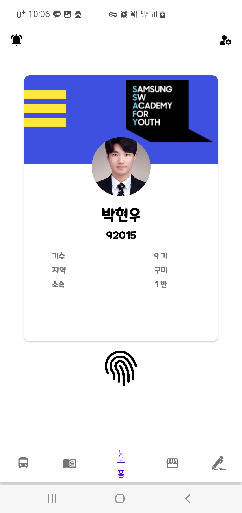

- 전자학생증을 통한 간편한 출입시스템, 개인 정보 제공

<br>

### 3.2. 도서관 대여

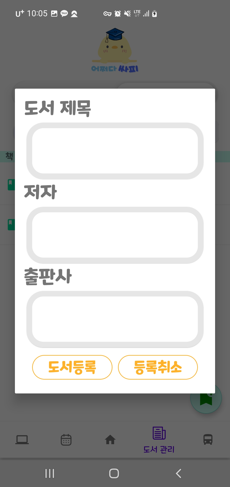
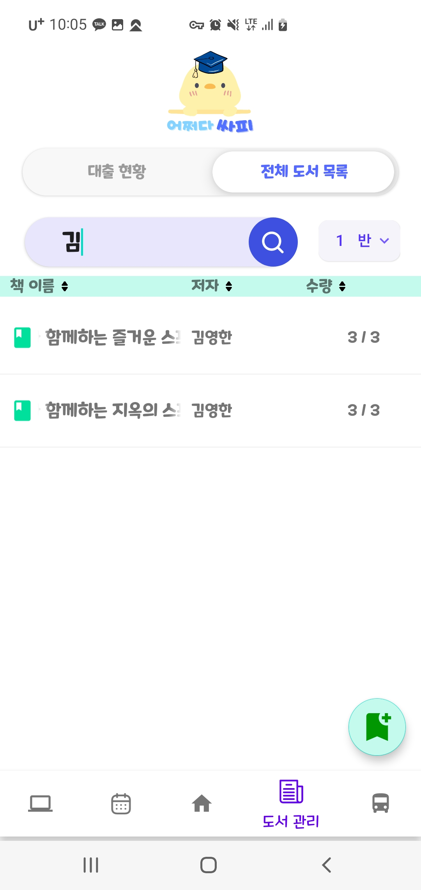

- 수기로 작성하는 도서관리 대장을 전자화
- 도서 반납/대출/현황을 QR코드로 빠르고 간편하게
- 비콘 근처에서만 작동하도록 제한

<br>

### 3.3. 문서 작업 간편화

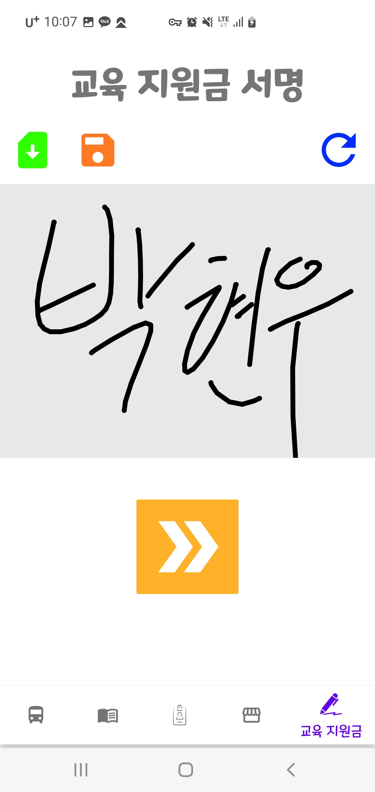
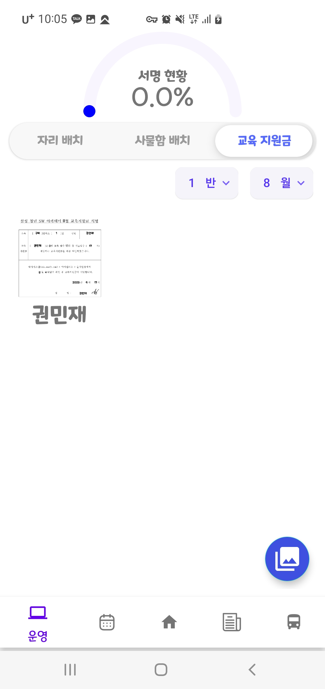

- 매달 반복되는 교육지원금 서명을 별도 저장소에 빠르게 생성하여 업로드
- 문서 작업 최소화를 위한 반, 월별 서명 이미지 합치기 기능

<br>

### 3.4. 자리 및 사물함 배치

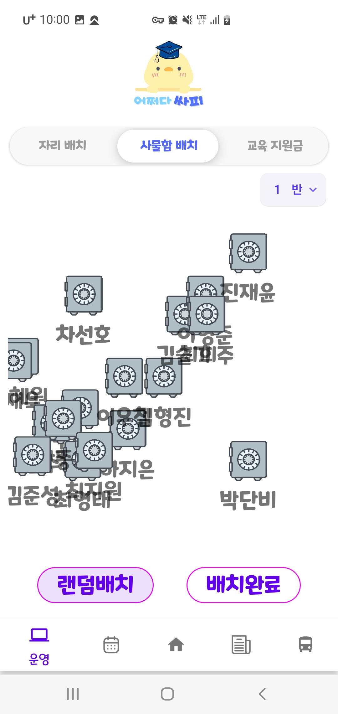
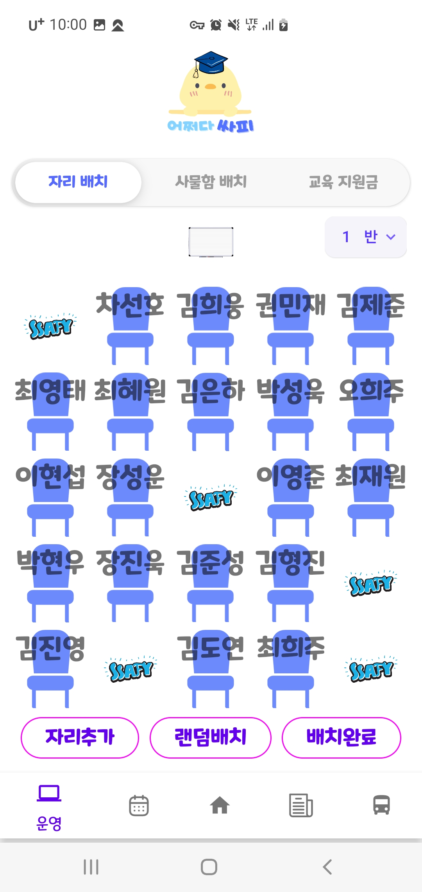

- 랜덤 자리배치 기능

<br>

### 3.5. 공지사항 전파

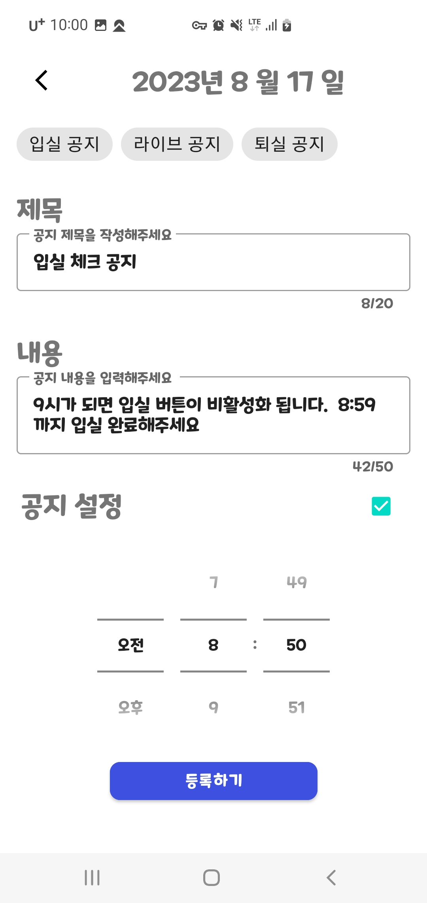

- 달력에 일정을 등록하여 정해진 시간에 일괄 공지사항 전파

<br>

### 3.6. 출결 관리

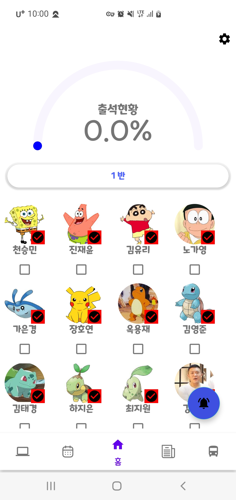

- 출결 상황을 한눈에 볼 수 있는 출석 현황표

<br>

### 3.7 중고거래

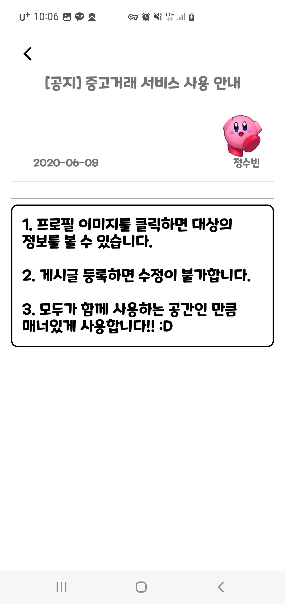
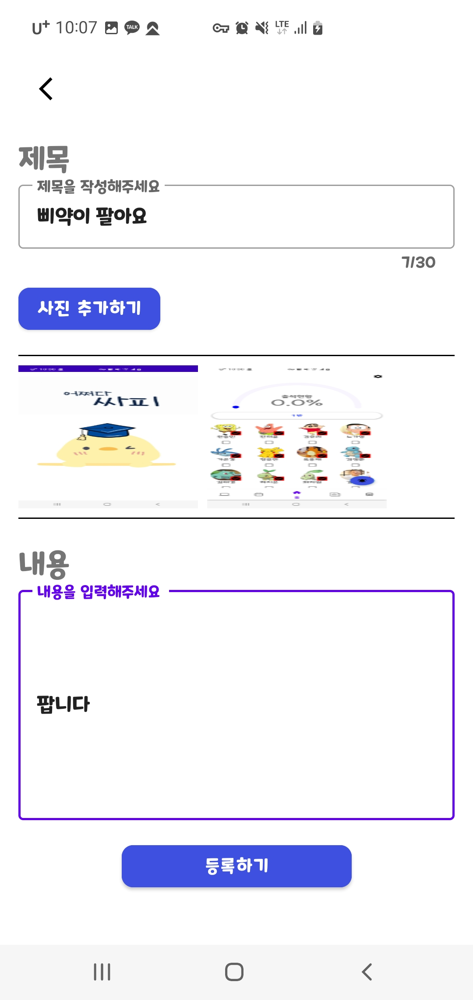

- 중고마켓을 통해 SSAFY 졸업 후 매물교환 창구 제공

<br>
<br>

## 4. 프로젝트 실행 방법

### 4.1. server 실행

1. **원격 저장소 복제(git clone)**

```bash
https://github.com/OneDayOneAlgorithm/AlgoArium.git
```

2. **MariaDB 10.11버전 설치**

```bash
https://mariadb.org/download/?t=mariadb&p=mariadb&r=10.11.6&os=windows&cpu=x86_64&pkg=msi&m=blendbyte
```

3. **HeidiSQL툴을 사용해서 사용자 : root / 암호 : 1234 로 세션 생성**

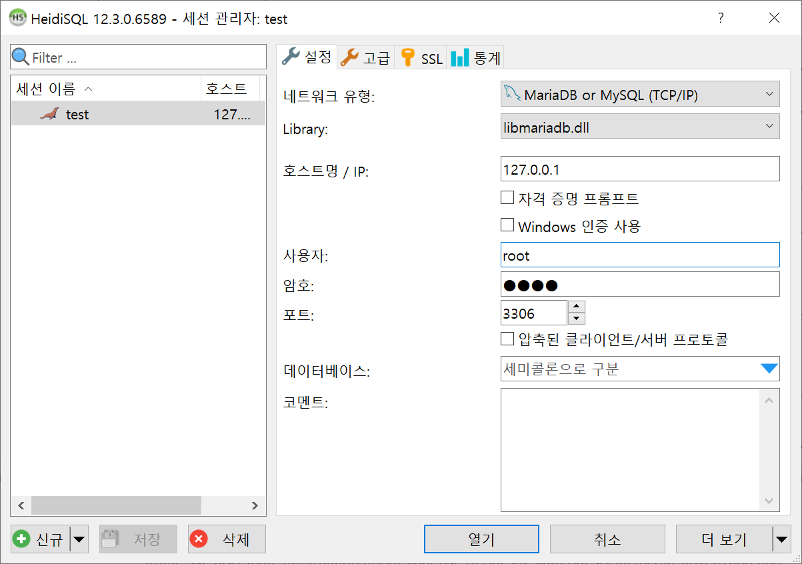

4. **이름 : test 로 DB 생성**

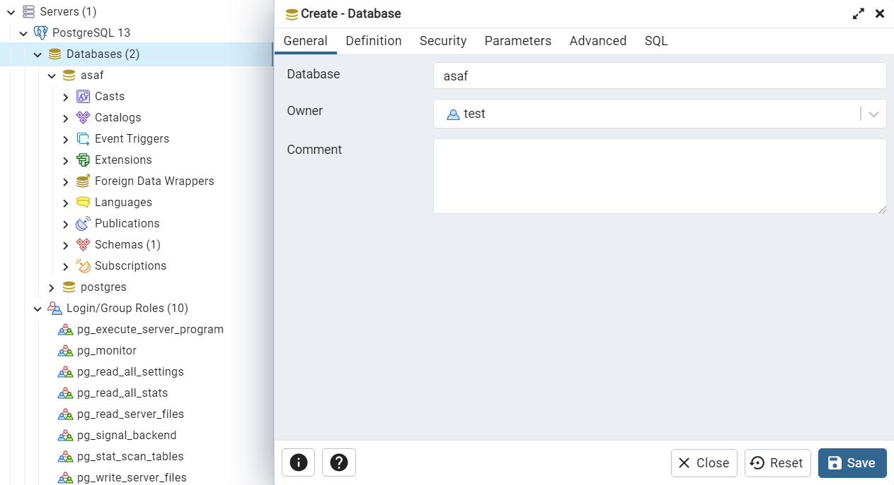

5. **jar 파일이 있는 경로로 이동**

```bash
$ cd BE/algoarium/build/libs
```

6. **서버 실행**

```bash
java -jar algoarium-0.0.1-SNAPSHOT.jar
```

<br>

### 4.2. client 실행

1. **응용 프로그램 실행**

```bash
$ cd Algoarium
$ start Algoarium.exe
// 이후 모바일에서 인증코드 확인 후 연동.
```

<br>

### 4.3 mobile 실행

1. **mobile 코드 경로로 이동**

```bash
$ cd AlgoArium\FE\Algo
```

2. **Adroid Studio로 실행**

<br>
<br>

## 5. 기술 스택

### 5.1. Back-End

- **Spring boot** : 알고알리움 Project의 전반적인 Rest Controller 구현.
- **JPA (Hibernate)** : ORM인 Hibernate를 활용하여 객체 중심의 개발을 할 수 있도록 하였고, SQL을 직접 작성하지 않고 Entity 필드가 되는 객체를 통해 DB를 동작시켜 유지보수에 용이하게 활용.
  - 동일한 쿼리에 대한 캐시 기능을 사용하기 때문에 높은 효율성 기대.
- **PostgreSQL** : RDBMS로 알고알리움의 사용자, 문제 정보 등 필요한 데이터를 저장.
  - 만료일을 저장하면 만료 시 자동으로 데이터가 사라지는 특성을 활용하여 카카오톡 인증 토큰을 저장하여 로그인에 활용.
- **AWS** : EC2 서비스를 이용하여 Ubuntu 서버를 구축 (호스팅).
- **Nginx** : 웹 서버를 구축
  - default.conf를 수정하여 EC2에 저장된 파일 경로를 참조할 수 있게 활용.

<br>

### 5.2. Front-End

- **Android Studio** : 어쩌다싸피 Project의 mobile 어플리케이션 구현.
- **NFC** : 아두이노를 활용한 NFC으로 출입 기능 구현.
- **SMTP** : Firebase Cloud Messaging을 사용해 모바일 알림기능 활성화.
- **IBeacon** : 도서관에 비콘을 설치해 사용 구역 제한.
- **QR Code** : 도서관 대출 기능 구현.

<br>

### 5.3. TEAM Cooperaion

- **GitLab**: GitLab을 활용하여 프로젝트를 관리.
  - Git Flow 에 따른 브랜치 전략 수립.
  - MR 시 코드 리뷰 진행.
- **Jira**: 이슈 관리 도구로 활용.
  - 주요 기능들을 이슈로 등록하고 Stroy Point를 산정한 후, 담당자를 지정하여 프로젝트를 진행.
  - 1~2 주 정도 상황에 맞게 스프린트를 설정.
- **Google Drive** : 협업을 위한 공용 문서 및 산출물들을 공유할 수 있도록 활용.
  - 동시 문서 작성 (Google Docs).
  - 대용량 파일 첨부.
- **Notion**
  - 일정 관리 및 트러블 슈팅 메모.
  - 세션을 통해 새로운 지식 공유.

<br>
<br>

## 6. 프로젝트 구조도

```
└─📂backend
    └─📁 idea
    └─📁 ASAF
└─📂frontend
    └─📁 ASAF
```

<details>
<summary>Back-End</summary>
<div markdown="1">

```
├─gradle
│  └─wrapper
├─META-INF
└─src
    ├─main
    │  ├─java
    │  │  ├─com
    │  │  │  └─ASAF
    │  │  │      ├─config
    │  │  │      ├─controller
    │  │  │      ├─dto
    │  │  │      ├─entity
    │  │  │      ├─repository
    │  │  │      └─service
    │  │  └─META-INF
    │  └─resources
    │      ├─META-INF
    │      ├─static
    │      │  └─images
    │      │      ├─profile_images
    │      │      └─sign_images
    │      └─templates
    └─test
        └─java
            └─com
                └─ASAF
```

</div>
</details>

<details>
<summary>Front-End</summary>
<div markdown="1">

```
├─.idea
│  └─codeStyles
├─app
│  ├─libs
│  └─src
│      ├─androidTest
│      │  └─java
│      │      └─com
│      │          └─d103
│      │              └─asaf
│      ├─main
│      │  ├─java
│      │  │  └─com
│      │  │      └─d103
│      │  │          └─asaf
│      │  │              ├─common
│      │  │              │  ├─component
│      │  │              │  │  └─adapter
│      │  │              │  ├─config
│      │  │              │  ├─model
│      │  │              │  │  ├─api
│      │  │              │  │  ├─dto
│      │  │              │  │  └─Room
│      │  │              │  ├─splash
│      │  │              │  └─util
│      │  │              └─ui
│      │  │                  ├─bus
│      │  │                  ├─home
│      │  │                  │  ├─pro
│      │  │                  │  └─student
│      │  │                  ├─join
│      │  │                  ├─library
│      │  │                  │  ├─adapter
│      │  │                  │  ├─pro
│      │  │                  │  └─student
│      │  │                  ├─login
│      │  │                  ├─market
│      │  │                  ├─noti
│      │  │                  ├─op
│      │  │                  │  ├─adapter
│      │  │                  │  └─dialog
│      │  │                  ├─schedule
│      │  │                  ├─setting
│      │  │                  └─sign
│      │  ├─jniLibs
│      │  │  ├─arm64-v8a
│      │  │  ├─armeabi
│      │  │  └─armeabi-v7a
│      │  └─res
│      │      ├─drawable
│      │      ├─drawable-v24
│      │      ├─font
│      │      ├─layout
│      │      ├─menu
│      │      ├─mipmap-anydpi-v26
│      │      ├─mipmap-hdpi
│      │      ├─mipmap-mdpi
│      │      ├─mipmap-xhdpi
│      │      ├─mipmap-xxhdpi
│      │      ├─mipmap-xxxhdpi
│      │      ├─navigation
│      │      ├─raw
│      │      ├─values
│      │      ├─values-night
│      │      └─xml
│      └─test
│          └─java
│              └─com
│                  └─d103
│                      └─asaf
└─gradle
    └─wrapper
```

</div>
</details>

<br>

## 7. Design

### 7.1. 시스템 구조도

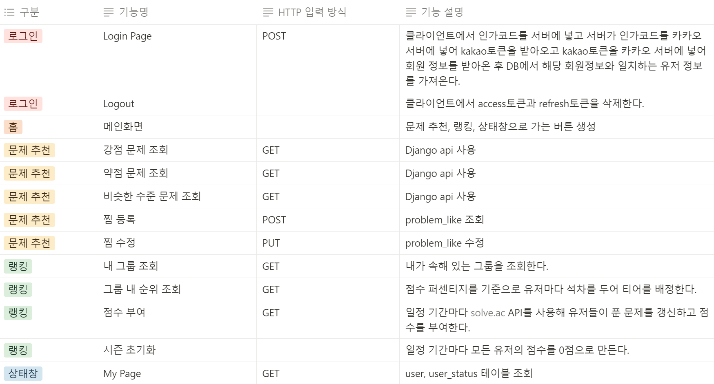

<br>

### 7.2. API 설계

[API 명세서](https://ten-brownie-866.notion.site/54edf2756f7848de9f43c8d8c85f85e3?pvs=4)

### 7.3. 기능 명세서

[기능 명세서](https://docs.google.com/spreadsheets/d/1YXWEoj4FwIA5q2wiOGrWThPSlwKs1TSfE4VgIX8EKCw/edit#gid=0)

### 7.4. ERD

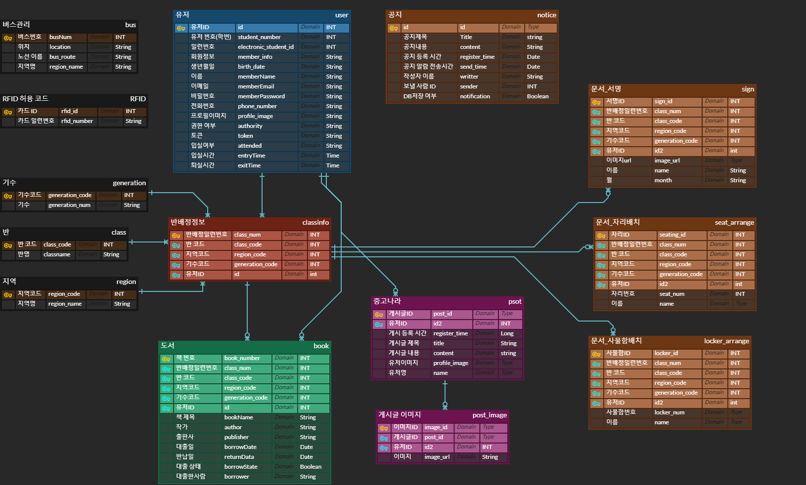

### 7.5. 배포

[배포 정보](exec/1번 문서.md)

<br>
<br>

## 8. Team

- 권민재 - Minjae Kwon - [Front]
- 김준성 - Junseong Kim - [Back]
- 김형진 - Hyungjin Kim - [Back]
- 박현우 - Hyunwoo Park - [Front]
- 장진욱 - Jinwook Jang - [Back]
- 최재원 - Jaewon Choi - [Front]
