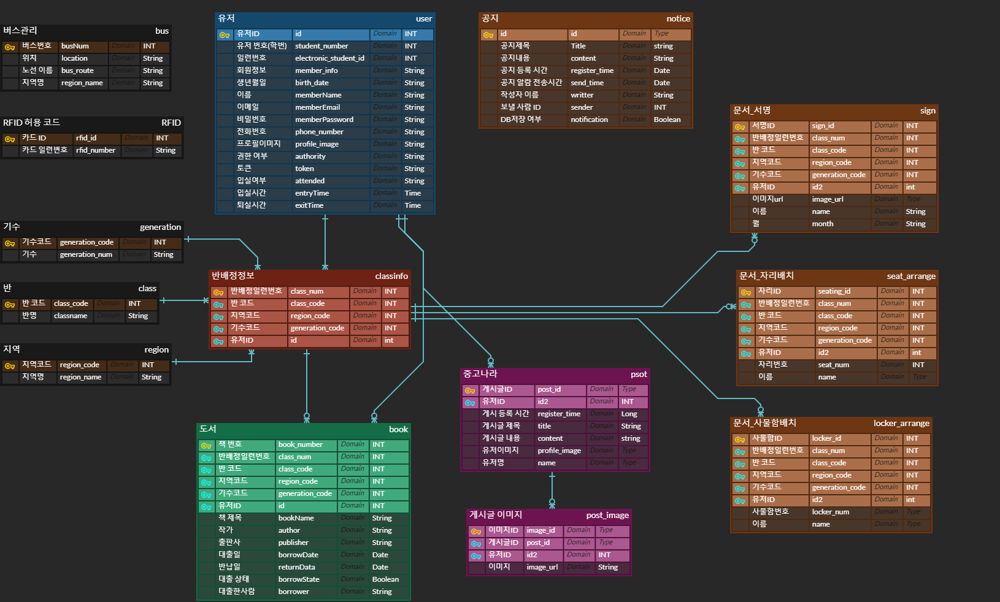
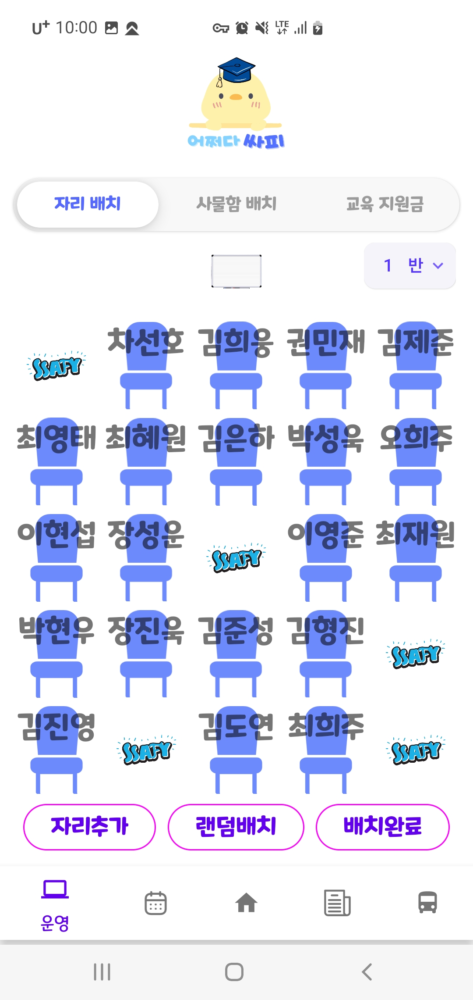
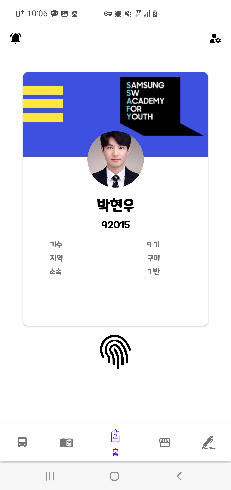
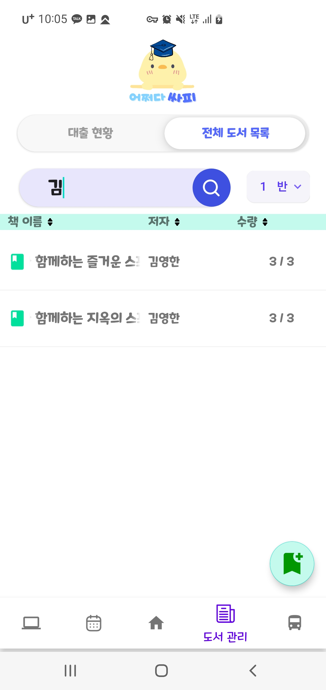
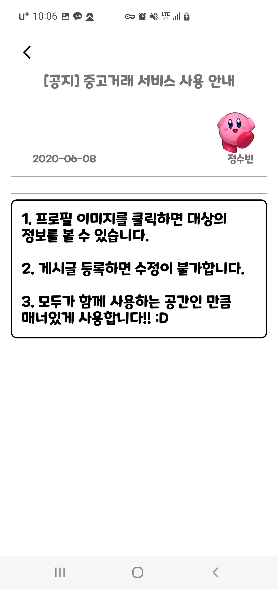

# 어쩌따 싸피 READEME

> ## 프로젝트 소개


## **개발동기**

><h2>SSAFY 구성원이 활용할 수 있는 사내 시스템 앱 개발</h2>

 - 수기로 작성하는 도서관리 대장을 전자화
 - 도서 반납/대출/현황을 QR코드로 빠르고 간편하게
 - 매달 반복되는 교육지원금 서명을 별도 저장소에 빠르게 생성하여 업로드
 - 문서 작업 최소화를 위한 반, 월별 서명 이미지 합치기 기능
 - 달력에 일정을 등록하여 정해진 시간에 일괄 공지사항 전파
 - 출결 상황을 한눈에 볼 수 있는 출석 현황표
 - 자리배치 등 자주 사용하는 기능 제공
 - 전자학생증을 통한 간편한 출입시스템, 개인 정보 제공
 - 중고마켓을 통해 SSAFY 졸업 후 매물교환 창구 제공
    

> ## 팀원 소개

    - 팀장 : 김준성
    - 팀원 : 박현우
    - 팀원 : 최재원
    - 팀원 : 장진욱
    - 팀원 : 권민재
    - 팀원 : 김형진


>## **사용된 기술**
Frontend<br>


Backend<br>


Infra<br>


Tool<br>


ETC<br>


<br><br>

## 기능 명세서

 [기능 명세서](https://docs.google.com/spreadsheets/d/1YXWEoj4FwIA5q2wiOGrWThPSlwKs1TSfE4VgIX8EKCw/edit#gid=0)

 ## ERD
 

 ## 배포 정보 

 [배포 정보](exec/1번 문서.md)

 ## 프로젝트 트리
 ```
 ├─.idea
├─backend
│  ├─.idea
│  └─ASAF
│      ├─.gradle
│      │  ├─8.0
│      │  │  ├─checksums
│      │  │  ├─dependencies-accessors
│      │  │  ├─executionHistory
│      │  │  ├─fileChanges
│      │  │  ├─fileHashes
│      │  │  └─vcsMetadata
│      │  ├─buildOutputCleanup
│      │  └─vcs-1
│      ├─.idea
│      ├─build
│      │  ├─classes
│      │  │  └─java
│      │  │      └─main
│      │  │          └─com
│      │  │              └─ASAF
│      │  │                  ├─config
│      │  │                  ├─controller
│      │  │                  ├─dto
│      │  │                  ├─entity
│      │  │                  ├─repository
│      │  │                  └─service
│      │  ├─generated
│      │  │  └─sources
│      │  │      ├─annotationProcessor
│      │  │      │  └─java
│      │  │      │      └─main
│      │  │      └─headers
│      │  │          └─java
│      │  │              └─main
│      │  ├─resources
│      │  │  └─main
│      │  │      ├─META-INF
│      │  │      ├─static
│      │  │      │  └─images
│      │  │      │      ├─profile_images
│      │  │      │      └─sign_images
│      │  │      └─templates
│      │  └─tmp
│      │      └─compileJava
│      │          └─compileTransaction
│      │              ├─annotation-output
│      │              ├─compile-output
│      │              │  └─com
│      │              │      └─ASAF
│      │              │          ├─config
│      │              │          ├─controller
│      │              │          ├─dto
│      │              │          ├─entity
│      │              │          ├─repository
│      │              │          └─service
│      │              ├─header-output
│      │              └─stash-dir
│      ├─gradle
│      │  └─wrapper
│      ├─META-INF
│      └─src
│          ├─main
│          │  ├─java
│          │  │  ├─com
│          │  │  │  └─ASAF
│          │  │  │      ├─config
│          │  │  │      ├─controller
│          │  │  │      ├─dto
│          │  │  │      ├─entity
│          │  │  │      ├─repository
│          │  │  │      └─service
│          │  │  └─META-INF
│          │  └─resources
│          │      ├─META-INF
│          │      ├─static
│          │      │  └─images
│          │      │      ├─profile_images
│          │      │      └─sign_images
│          │      └─templates
│          └─test
│              └─java
│                  └─com
│                      └─ASAF
├─exec
└─frontend
    └─ASAF
        ├─.idea
        │  └─codeStyles
        ├─app
        │  ├─libs
        │  └─src
        │      ├─androidTest
        │      │  └─java
        │      │      └─com
        │      │          └─d103
        │      │              └─asaf
        │      ├─main
        │      │  ├─java
        │      │  │  └─com
        │      │  │      └─d103
        │      │  │          └─asaf
        │      │  │              ├─common
        │      │  │              │  ├─component
        │      │  │              │  │  └─adapter
        │      │  │              │  ├─config
        │      │  │              │  ├─model
        │      │  │              │  │  ├─api
        │      │  │              │  │  ├─dto
        │      │  │              │  │  └─Room
        │      │  │              │  ├─splash
        │      │  │              │  └─util
        │      │  │              └─ui
        │      │  │                  ├─bus
        │      │  │                  ├─home
        │      │  │                  │  ├─pro
        │      │  │                  │  └─student
        │      │  │                  ├─join
        │      │  │                  ├─library
        │      │  │                  │  ├─adapter
        │      │  │                  │  ├─pro
        │      │  │                  │  └─student
        │      │  │                  ├─login
        │      │  │                  ├─market
        │      │  │                  ├─noti
        │      │  │                  ├─op
        │      │  │                  │  ├─adapter
        │      │  │                  │  └─dialog
        │      │  │                  ├─schedule
        │      │  │                  ├─setting
        │      │  │                  └─sign
        │      │  ├─jniLibs
        │      │  │  ├─arm64-v8a
        │      │  │  ├─armeabi
        │      │  │  └─armeabi-v7a
        │      │  └─res
        │      │      ├─drawable
        │      │      ├─drawable-v24
        │      │      ├─font
        │      │      ├─layout
        │      │      ├─menu
        │      │      ├─mipmap-anydpi-v26
        │      │      ├─mipmap-hdpi
        │      │      ├─mipmap-mdpi
        │      │      ├─mipmap-xhdpi
        │      │      ├─mipmap-xxhdpi
        │      │      ├─mipmap-xxxhdpi
        │      │      ├─navigation
        │      │      ├─raw
        │      │      ├─values
        │      │      ├─values-night
        │      │      └─xml
        │      └─test
        │          └─java
        │              └─com
        │                  └─d103
        │                      └─asaf
        └─gradle
            └─wrapper
```

>## **미리보기**



<br>
 
 
 

