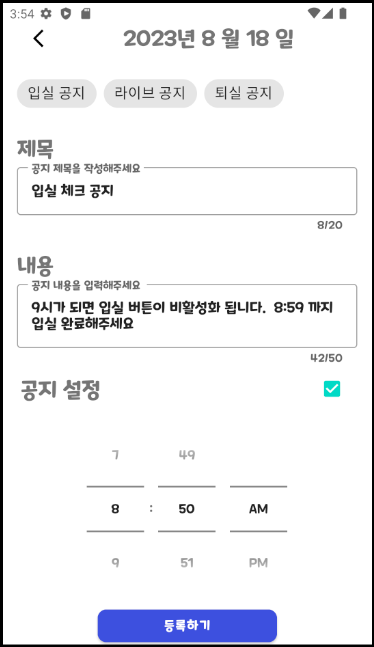

## 시연 시나리오

- 시연 시 사용할 사이트 화면별, 실행별(클릭 위치 등) 상세 설명을 포함한 문서를 작성합니다.
  - 전체적인 시연 순서를 기술하고, 각 화면과 기능에 대한 실행 순서 및 동작 설명을 구체적으로 작성합니다.
  - 테스트 데이터로 시연할 경우, 일관된 예시 데이터를 사용하는 것이 좋습니다.

## <전자 학생증>

### 전자 학생증 활성화 

  - 지문 버튼을 누른 후 지문인식을 한 후 나오는 전자 학생증을 보여준다.

## <교육 지원금 서명>

### 싸인 화면

  - 교육 지원금 서명 탭으로 이동 후 싸인을 그리고 다음 버튼을 누른다.

### 날짜 선택

  - 드롭박스를 통해 교육 지원금 날짜를 입력후 문서확인 버튼을 눌러 문서를 생성한다.

### 지원금 전송

  - 업로드 버튼을 눌러 지원금 서명서를 전송한다.

### 지원금 서명서 확인

  - 프로 측에서 지원금 서명 탭으로 이동 후 잘 왔는지 확인 후 모두 왔다면 FAB 버튼을 눌러 하나의 서명서로 합쳐 메일로 전송한다.

## <출석 체크>

### 프로 홈 화면

### 지각 알림 보내기

  - 학생을 선택 후 FAB 버튼을 눌러 지각 알림을 보낸다.

### 학생 알림 확인

  - 학생 홈 화면의 알림버튼을 클릭하여 받았던 알림을 확인한다. 

## <공지 발송>

### 스케줄 화면

 - 날짜를 선택하고 공지 등록을 누르면 공지 작성 화면으로 이동한다.

### 공지 작성

 - 직접 작성하거나 위에 있는 칩을 선택하면 공지를 쓰고 공지 등록을 눌러 학생들에게 선택한 시간에 공지를 전송한다.

 

## <자리 배치>

### 프로 자료배치  화면 

 - 프로 자리 배치 화면에서 이동하려고 하는 학생의 자리를 이동 후 배치 완료 버튼을 누른다.

### 자리 배치 확인

 - 학생 측에서 학생증을 뒤집으면 바뀐 위치를 확인할 수 있다.

## <중고 마켓>

### 중고 매물 등록하기

  - 학생 측에서 중고마켓 탭에 + 버튼을 눌러 중고 매물 작성 화면으로 이동한다.

### 중고 매물 등록

 - 작성 화면에서 사진이나 글 작성후 등록하기를 눌러 게시글을 등록한다.

 

### 등록된 게시글 확인 밎 작성자 정보 확인

  - 작성된 게시글을 클릭 후 정보를 확인 후 작성자 프로필을 클릭하여 작성자 정보 화면을 띄운다.

  

### 게시글 삭제
  - 삭제 버튼을 눌러 게시글을 삭제한다.

